# Non-stationary Transformers

This is the codebase for the paper:
[Non-stationary Transformers: Exploring the Stationarity in Time Series Forecasting](https://arxiv.org/abs/2205.14415), NeurIPS 2022.

:triangular_flag_on_post: **News** (2023.02) Non-stationary Transformer has been included in [[Time-Series-Library]](https://github.com/thuml/Time-Series-Library), which covers long- and short-term forecasting, imputation, anomaly detection, and classification.

## Discussions

There are already several discussions about our paper, we appreciate a lot for their valuable comments and efforts: [[Official]](https://mp.weixin.qq.com/s/LkpkTiNBVBYA-FqzAdy4dw), [[OpenReview]](https://openreview.net/forum?id=ucNDIDRNjjv), [[Zhihu]](https://zhuanlan.zhihu.com/p/535931701).

## Their Architecture

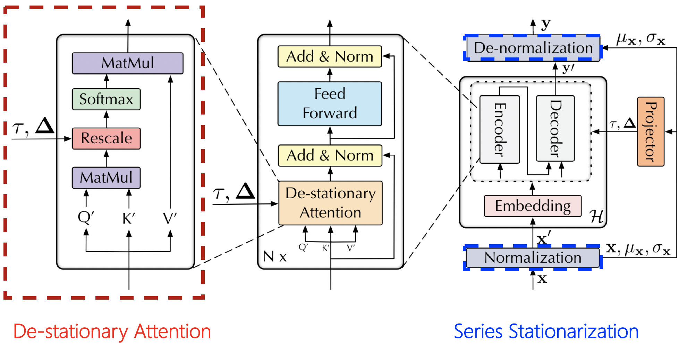
## Arima and Transformer Architecture
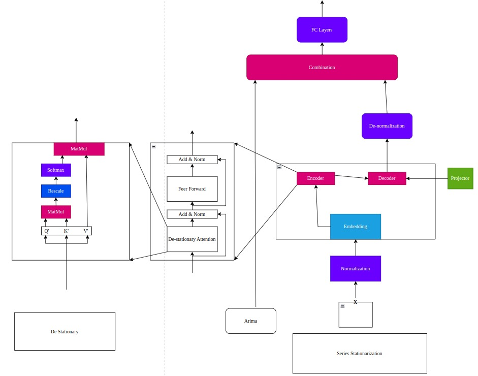

## Change Point Architecture
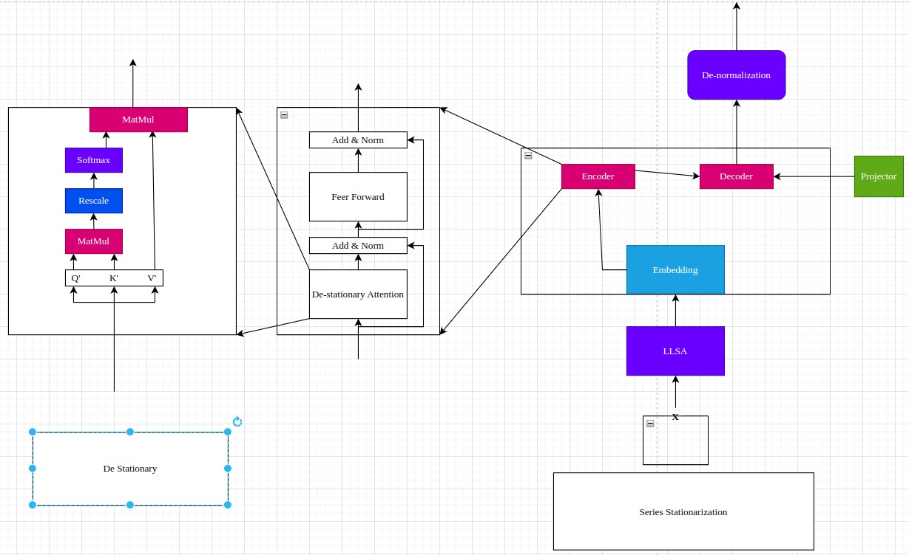
### Series Stationarization

Series Stationarization unifies the statistics of each input and converts the output with restored statistics for better predictability. 

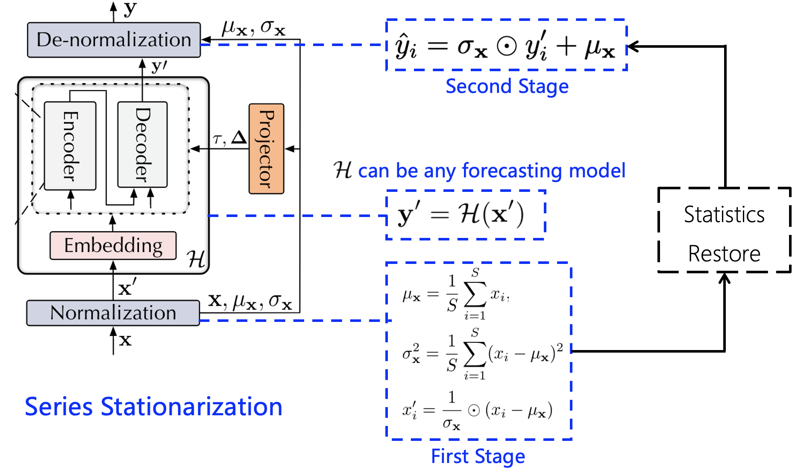

### De-stationary Attention

De-stationary Attention is devised to recover the intrinsic non-stationary information into temporal dependencies by approximating distinguishable attentions learned from unstationarized series. 

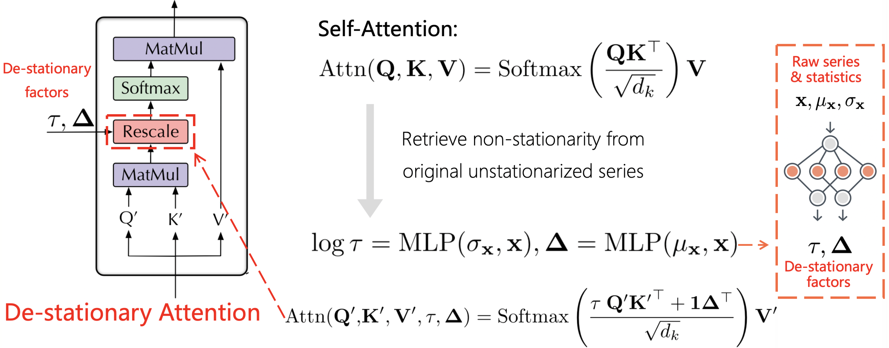


## Showcases

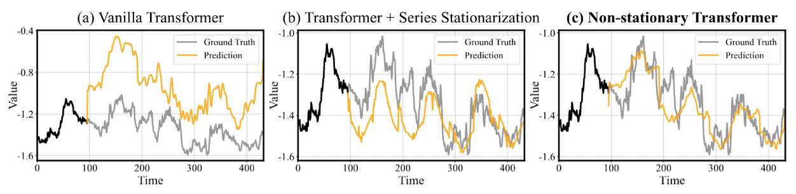

## Preparation

1. Install Python 3.7 and neccessary dependencies.
```
pip install -r requirements.txt
```
2. All the six benchmark datasets can be obtained from [Google Drive](https://drive.google.com/drive/folders/10qYO-N10LmyZhHg0KfAEKAQVho4HL2Dm?usp=sharing).

## Training scripts

### Non-stationary Transformer

We provide the Non-stationary Transformer experiment scripts and hyperparameters of all benchmark dataset under the folder `./scripts`.

```bash
# Transformer with papers framework
bash ./scripts/ECL_script/ns_Transformer.sh
bash ./scripts/Traffic_script/ns_Transformer.sh
bash ./scripts/Weather_script/ns_Transformer.sh
bash ./scripts/ILI_script/ns_Transformer.sh
bash ./scripts/Exchange_script/ns_Transformer.sh
bash ./scripts/ETT_script/ns_Transformer.sh
bash ./scripts/Stock_scripts/ns_Transformer.sh
```
```bash
# Transformer with our change point framework
bash ./scripts/ECL_script/ns_Transformer_change_point.sh
bash ./scripts/Traffic_script/ns_Transformer_change_point.sh
bash ./scripts/Weather_script/ns_Transformer_change_point.sh
bash ./scripts/ILI_script/ns_Transformer_change_point.sh
bash ./scripts/Exchange_script/ns_Transformer_change_point.sh
bash ./scripts/ETT_script/ns_Transformer_change_point.sh
bash ./scripts/Stock_scripts/ns_Transformer_change_point.sh
```
```bash
# Transformer with our arima and transformer framework
bash ./scripts/ECL_script/ns_Transformer_arima.sh
bash ./scripts/Traffic_script/ns_Transformer_arima.sh
bash ./scripts/Weather_script/ns_Transformer_arima.sh
bash ./scripts/ILI_script/ns_Transformer_arima.sh
bash ./scripts/Exchange_script/ns_Transformer_arima.sh
bash ./scripts/ETT_script/ns_Transformer_arima.sh
bash ./scripts/Stock_scripts/ns_Transformer_arima.sh
```

```bash
# Transformer baseline
bash ./scripts/ECL_script/Transformer.sh
bash ./scripts/Traffic_script/Transformer.sh
bash ./scripts/Weather_script/Transformer.sh
bash ./scripts/ILI_script/Transformer.sh
bash ./scripts/Exchange_script/Transformer.sh
bash ./scripts/ETT_script/Transformer.sh
```

### Non-stationary framework to promote other Attention-based models 

We also provide the scripts for other Attention-based models (Informer, Autoformer), for example:

```bash
# Informer promoted by our Non-stationary framework
bash ./scripts/Exchange_script/Informer.sh
bash ./scripts/Exchange_script/ns_Informer.sh

# Autoformer promoted by our Non-stationary framework
bash ./scripts/Weather_script/Autoformer.sh
bash ./scripts/Weather_script/ns_Autoformer.sh
```

## Experiment Results
### Our Results and Paper Comparison
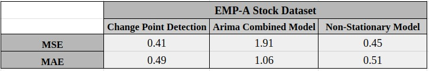
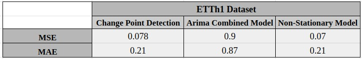
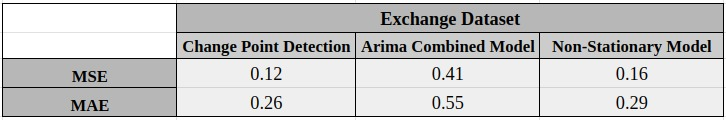

### Main Results From Paper

For multivariate forecasting results, the vanilla Transformer equipped with our framework consistently achieves state-of-the-art performance in all six benchmarks and prediction lengths.

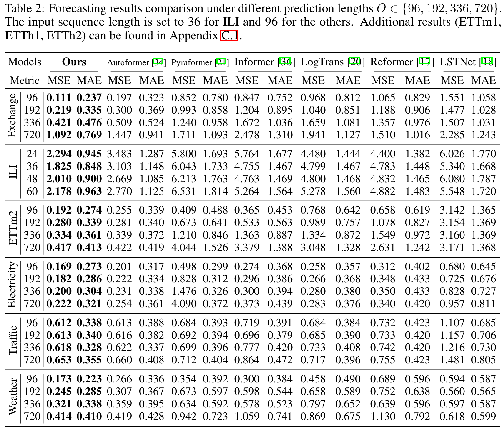

### Model Promotion From Paper

By applying our framework to six mainstream Attention-based models. Our method consistently improves the forecasting ability. Overall, it achieves averaged **49.43%** promotion on Transformer, **47.34%** on Informer, **46.89%** on Reformer, **10.57%** on Autoformer, **5.17%** on ETSformer and **4.51%** on FEDformer, making each of them surpass previous state-of-the-art.

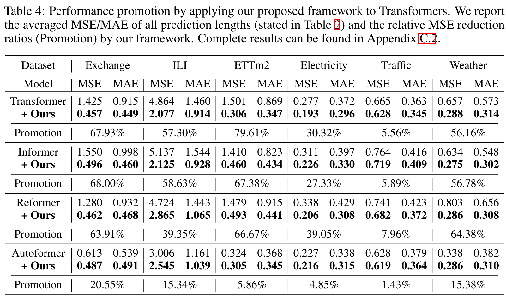


## Contact

If you have any questions or want to use the code, please contact berkay.acbay@ozu.edu.tr , arda.erdogan@ozu.edu.tr or gunes.altiner@ozu.edu.tr.
